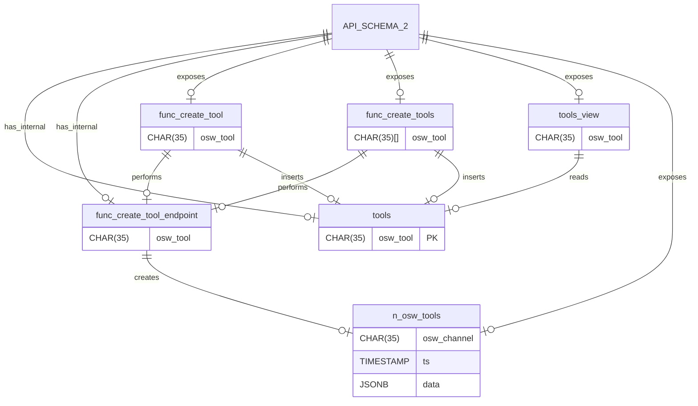

# TimescaleDB PostgREST

Table of Contents

- [TimescaleDB PostgREST](#timescaledb-postgrest)
  - [Database Schema](#database-schema)
  - [Dataset Example](#dataset-example)

## Database Schema

- Each OSW Tool own endpoint, osw_channel is direct attribute of each osw_tool table/endpoint
- in this version it is not possible to query all data from all tools (either dynamic/sub query function or combined channel references reqired)



## Dataset Example

Tools, each labled by OSW-UUID for each Tool as own Endpoints
representing hypertables in postgres are used in this schema.
Channels as part of tools used are also labled by OSW-UUIDs.
Data Objects on 'api.<TOOL_OSW_UUID>' have format:

```json
{
    "osw_channel": "<CHANNEL_OSW_UUID>",
    "ts": "<TIMESTAMP>",
    "data": {},
}
```


## Prerequisites

- Docker, Docker Compose
- Local data directory or linked directory (optionally use docker volume)


### Using Mounted Directory

Create local data directory with right permissions, for instance 1st pgdata directory:

```bash
sudo mkdir -p /mnt/tsdb-pgrst-1_pgdata
sudo chown -R 1000:1000 /mnt/tsdb-pgrst-1_pgdata
```

Symlink to local directory to be used by docker-compose:

```bash
sudo ln -s /mnt/tsdb-pgrst-1_pgdata pgdata
```
