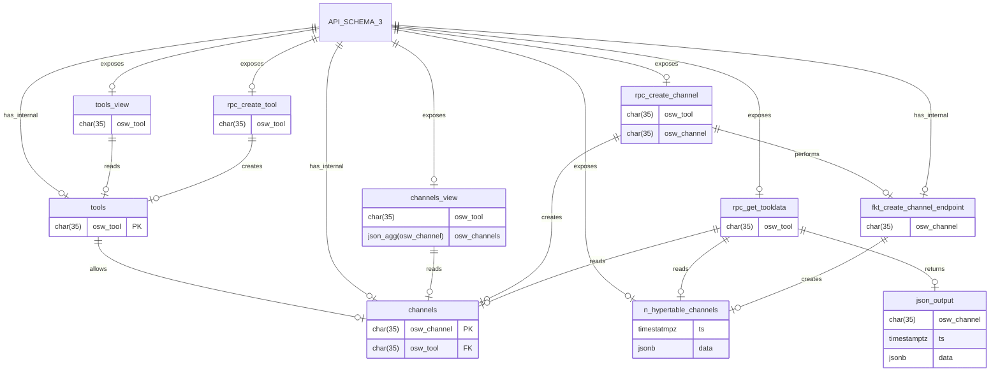
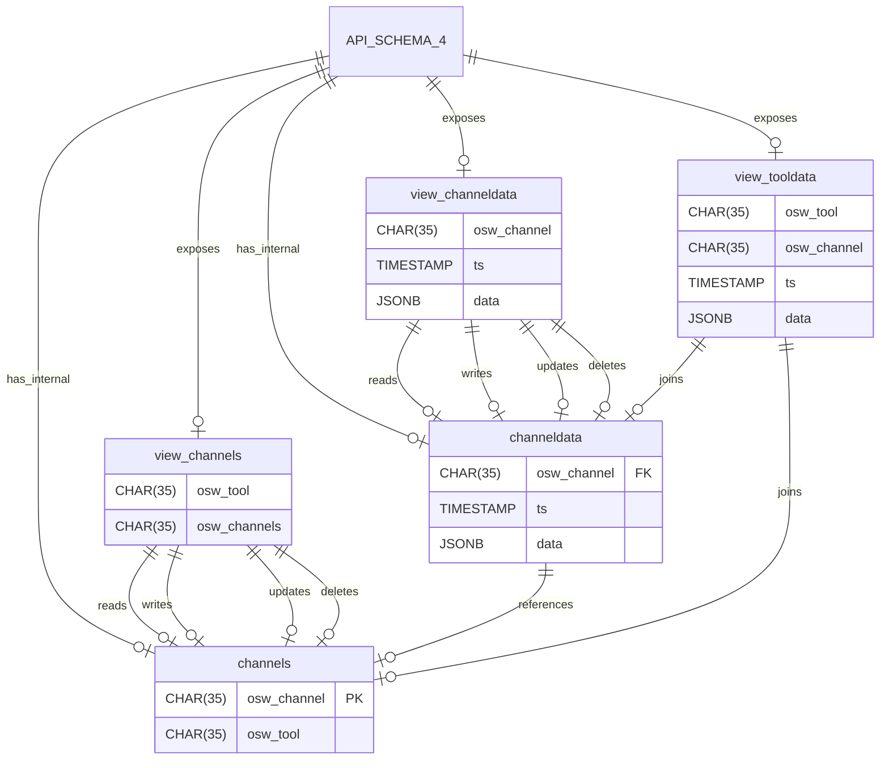

# TimescaleDB PostgREST

- [TimescaleDB PostgREST](#timescaledb-postgrest)
  - [To be discussed](#to-be-discussed)
  - [OSW TSDB: Schemas and Queries](#osw-tsdb-schemas-and-queries)
    - [Option 1](#option-1)
    - [Option 2](#option-2)
    - [Option 3](#option-3)
    - [Option 4](#option-4)
      - [Schema 4](#schema-4)
      - [Queries](#queries)
  - [Benchmarking](#benchmarking)
    - [Locust (Open Source: MIT, Python-based)](#locust-open-source-mit-python-based)

## To be discussed

- [ ] OSW or typed UUIDs as PK/FK, see [Choosing PK Type](https://shekhargulati.com/2022/06/23/choosing-a-primary-key-type-in-postgres/)

## OSW TSDB: Schemas and Queries

### Option 1

- Serial Index PK-Channels with FK-Relation of OSW-Tool Tables

```mermaid
erDiagram
  a[API_SCHEMA_1]
  c[channels] {
    SERIAL channel_id PK
    CHAR(35) osw_channel
    CHAR(35) osw_tool
  }
  cv[channels_view] {
    SERIAL id
    CHAR(35) osw_channel
    CHAR(35) osw_tool
  }
  nt[n_osw_tools] {
    INT tool_id FK
    TIMESTAMP ts
    JSONB data
  }
  tcd[func_tool_condition] {
    CHAR(35) osw_tool
  }
  cte[func_create_tool_endpoint] {
    CHAR(35) osw_tool
  }
  ida[rpc_insert_data_array] {
    CHAR(35)[] osw_channel
    TIMESTAMPZ[] ts
    JSONB[] data
  }
  idj[rpc_insert_data_json] {
    JSON[] payload
  }
  wc[func_watch_channels] {
    NEW osw_tool
  }
  tet[trig_tool_endpoint_trigger] {
    ROW_INSERT channels
  }
  a ||--o| c : has_internal
  a ||--o| tcd : has_internal
  a ||--o| cte : has_internal
  a ||--o| tet : has_internal
  a ||--o| wc : has_internal
  a ||--o| ida : exposes
  a ||--o| idj : exposes
  a ||--o| cv : exposes
  a ||--o| nt : exposes
  cv ||--o| c : views
  tet ||--o| wc : triggers
  tet ||--o| c : watches
  wc ||--o| cte : performs
  wc ||--o| c : reads
  cte ||--o| tcd : reads
  cte ||--o| nt : creates
  tcd ||--o| a : reads
  tcd ||--o| c : reads
  ida ||--o| c : reads
  ida ||--o| nt : inserts
  idj ||--o| c : reads
  idj ||--o| nt : inserts
  nt ||--o| c : references
  ```

### Option 2

- Each OSW Tool own endpoint, osw_channel is direct attribute of each osw_tool table/endpoint
- in this version it is not possible to query all data from all tools (either dynamic/sub query function or combined channel references reqired)

```mermaid
erDiagram
  a[API_SCHEMA_2]
  t[tools] {
    CHAR(35) osw_tool PK
  }
  tv[tools_view] {
    CHAR(35) osw_tool
  }
  fcte[func_create_tool_endpoint] {
    CHAR(35) osw_tool
  }
  fct[func_create_tool] {
    CHAR(35) osw_tool
  }
  fcts[func_create_tools] {
    CHAR(35)[] osw_tool
  }
  nt[n_osw_tools] {
    CHAR(35) osw_channel
    TIMESTAMP ts
    JSONB data
  }
  a ||--o| t : has_internal
  a ||--o| fcte : has_internal
  a ||--o| fct : exposes
  a ||--o| fcts : exposes
  a ||--o| tv : exposes
  a ||--o| nt : exposes
  tv ||--o| t : reads
  fct ||--o| fcte : performs
  fct ||--o| t : inserts
  fcts ||--o| fcte : performs
  fcts ||--o| t : inserts
  fcte ||--o| nt : creates
```

### Option 3

- Each OSW Channel own endpoint
- Views:
  - channels
  - tools  
- RPC's:
  - to query data of all channels of a tool
  - to create a tool, a tool with a channel or multiple channels
  - to create channels of existing tools



### Option 4

- Channels and Channeldata Tables with OSW-Tools and OSW-Channel Attributes
- Only one Hypertable for timeseries data (index on timestamp)
- Autodetecting of not inititalized channels and tools
- Internals for API version control
  - channels
  - channeldata
- Views:
  - channels
  - channeldata
  - tooldata

#### Schema 4



#### Queries

- All variations of queries on endpoint `view_channels` possible through [Resource Embedding](https://postgrest.org/en/v12/references/api/resource_embedding.html)
- see Thunderclient Collection

## Benchmarking

### Locust (Open Source: MIT, Python-based)

- [Website](https://locust.io/)
- [Documentation](https://docs.locust.io/en/stable/)
- [Repository](https://github.com/locustio/locust)
- [Web UI Docker Image](https://hub.docker.com/r/locustio/locust)
